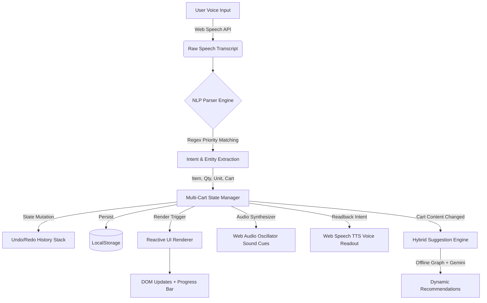

# SayCarts — Voice-First Multi-Cart Shopping Assistant

<div align="center">

[](https://saycarts.vercel.app)
[](https://saycarts.vercel.app)
[](#technical-architecture)
[](#license)

<p align="center">
  <b>A voice-operated multi-cart shopping application with dual-engine recommendations, offline Web Speech NLP, bidirectional text-to-speech feedback, and zero external runtime dependencies.</b>
</p>

[Live Demo](https://saycarts.vercel.app) • [Voice Commands](#voice-command-matrix) • [Technical Approach](#technical-approach) • [Architecture](#technical-architecture) • [Quick Start](#quick-start)

---

</div>

<a id="problem-statement"></a>
## Problem Statement

Most shopping list applications are built around a single flat list. In practice, users manage multiple shopping contexts at the same time: a weekly grocery run, wholesale purchases, party supplies, pharmacy items, and home essentials. Conventional applications create friction by requiring manual list switching, repetitive screen taps, and mixed-up items across categories.

SayCarts addresses this with a voice-first multi-cart workflow. Users can create, switch between, add items to specific background carts, audit, and merge lists through natural spoken language—with sub-50ms offline intent parsing, cross-cart routing, and spoken audio confirmation.

---

<a id="technical-approach"></a>
## Technical Approach

To address the limitations of conventional single-list shopping tools, SayCarts was designed with a client-first, zero-overhead architecture focused on responsiveness, modularity, and natural interaction.

1. **Deterministic Voice & NLP Pipeline**: Rather than relying on cloud-based speech APIs for simple commands, the application uses the browser's native Web Speech API coupled with a prioritized regex entity parser. This enables sub-50ms extraction of quantities, colloquial counts (such as "half dozen" or "a couple"), measurement units, target cart designations, and compound multi-item statements entirely on-device.

2. **Isolated Multi-Cart State Machine**: Cart state is managed through an immutable, event-driven pattern in vanilla JavaScript. Each cart functions as an independent workspace with its own item collections, completion telemetry, and metadata, while supporting atomic cross-cart actions like targeted voice routing and list merging. A 30-step snapshot stack provides reliable undo/redo capabilities.

3. **Hybrid Recommendation Strategy**: Recommendations follow a two-tier model: an instant offline co-occurrence knowledge graph for common pairings and seasonal suggestions, supplemented by an optional client-side Google Gemini Flash integration for complex contextual recipe planning.

4. **Zero-Dependency Native Stack**: Built entirely on native web standards (ES6+ modules, CSS custom properties, Web Audio API oscillator synthesis, and Service Worker caching), the application runs offline as an installable PWA with zero build tooling or third-party runtime libraries.

---

<a id="comparison"></a>
## Key Capabilities & Comparison

| Feature / Capability | Standard Shopping Lists | Smart Assistants (Alexa, Siri) | SayCarts |
| :--- | :--- | :--- | :--- |
| **Multi-Cart Architecture** | Single list or sub-menus | Single default list | Multiple isolated carts with custom color themes |
| **Voice Cross-Cart Routing** | Not supported | Adds only to default list | Direct routing: `"Add 2L milk to Costco cart"` |
| **Voice Cart Merging** | Manual copy/re-entry | Not supported | Voice-driven combine: `"Merge Party into Weekly"` |
| **Bidirectional TTS Readback** | Visual only | Slow cloud response | Instant local speech synthesis (`"Read my cart"`) |
| **Parsing Latency** | N/A | 800ms – 2500ms (Cloud roundtrip) | < 50ms (Deterministic priority regex tokenizer) |
| **Smart Suggestions** | Static or none | Purchase history only | Dual Engine: Offline graph + Gemini AI |
| **Local Market Product Catalog** | Generic search | Generic search | 100+ realistic items with INR prices, brands, and ratings |
| **Offline & Privacy First** | Partial sync required | Cloud connection required | 100% Offline PWA (Service Worker + LocalStorage) |
| **Build & Setup Complexity** | Framework dependencies | Hardware / skill setup | Zero build step, vanilla web standards |

---

<a id="features"></a>
## Core Features & Architecture

### 1. Zero-Latency Natural Language Voice Pipeline
* **Intent Classification**: Handles conversational phrases such as `"I need"`, `"Please add"`, `"Pick up"`, `"Don't forget"`, as well as Hindi phrasing like `"Chahiye"` and `"Daal do"`.
* **Multi-Item Batch Voice Extraction**: Spoken compound sentences like `"Add milk, 2 dozen eggs and a loaf of bread"` are parsed and split into distinct catalog items in a single pass.
* **Numeral and Unit Normalization**: Converts spoken counts (`"a dozen"` to 12, `"half dozen"` to 6, `"a couple"` to 2) and standardizes units (`litres`, `kg`, `packs`, `bottles`, `cans`).
* **Bidirectional Speech Feedback (TTS)**: Built-in Web Speech Synthesis speaks back cart summaries and item counts in English and Hindi.
* **Multilingual Recognition**: Supports recognition across 8 languages including English, Hindi, Spanish, French, German, Mandarin, Portuguese, and Arabic.

### 2. Multi-Cart State Machine & Cross-Cart Routing
* **Contextual Voice Routing**: Route items into background carts without switching active views (`"Add diapers to Pharmacy list"`).
* **Voice Cart Operations**: Voice-create (`"New cart Diwali Party"`), voice-switch (`"Switch to Costco"`), voice-clear (`"Clear the cart"`), and voice-merge (`"Merge Weekend into Weekly"`).
* **Deterministic Undo/Redo**: Action snapshot history stack accessible via voice (`"Undo that"`) or keyboard (`Ctrl+Z`).
* **Cart Progress & Budget Telemetry**: Real-time completion progress tracking, item counters, and total price calculation in INR.

### 3. Dual-Engine Hybrid Recommendation System
```
                                ┌────────────────────────────────────────┐
                                │          User Cart Contents            │
                                └───────────────────┬────────────────────┘
                                                    │
                         ┌──────────────────────────┴──────────────────────────┐
                         ▼                                                     ▼
        ┌──────────────────────────────────┐                 ┌──────────────────────────────────┐
        │     Engine A: Offline Matrix     │                 │     Engine B: Generative AI      │
        ├──────────────────────────────────┤                 ├──────────────────────────────────┤
        │ • Co-Occurrence Knowledge Graph  │                 │ • Google Gemini Flash API        │
        │ • 12-Month Seasonal Matrix       │                 │ • Contextual Recipe Completion   │
        │ • Dietary / Substitute Resolver   │                 │ • Zero-Config Cloud Fallback     │
        └──────────────────────────────────┘                 └──────────────────────────────────┘
```
1. **Offline Graph Engine**:
   * **Frequently Bought Together**: Association rule mapping (e.g., Pasta maps to Pasta Sauce, Cheese, and Garlic).
   * **Dietary Substitutes**: Alternative options for dairy-free, gluten-free, vegan, and budget choices.
   * **Seasonal Matrix**: Serves season-specific essentials based on the active calendar month.
2. **Generative AI Hook (Google Gemini Flash)**:
   * Direct, secure client-side API bridge to analyze cart contents and recommend companion ingredients with no backend server required.

### 4. Curated Product Catalog
* Grocery catalog with verified Indian brands (Amul, Tata Sampann, Aashirvaad, Everest, MDH, Dabur, Fortune, Eggoz).
* Complete metadata schema: Product Name, Brand, Pack Size, Price in INR, Star Ratings, Review Count, and Search Tags.
* Interactive product browser with category filtering, real-time search, and one-tap cart addition.

### 5. Responsive UI and Audio Feedback
* **Design System**: Built with CSS custom properties, responsive typography (Plus Jakarta Sans and Outfit), and micro-transitions.
* **Web Audio API Synthesizer**: Programmatic audio cues generated via Web Audio oscillators for microphone toggle, item addition, item completion, and deletion (zero external audio file dependencies).
* **Voice Waveform Indicator**: Real-time visual feedback for listening, processing, and idle states.
* **Export and Sharing**: Instant export to clipboard, plain text, and WhatsApp-formatted grocery checklists.

---

<a id="voice-command-matrix"></a>
## Voice Command Matrix

| Spoken Voice Command | Intent Classification | Action Executed |
| :--- | :--- | :--- |
| `"Add 2 litres of toned milk"` | `ADD_ITEM` | Parses quantity `2`, unit `litre`, matches catalog, and adds to active cart |
| `"Add 10kg atta to Costco cart"` | `ADD_TO_CART` | Routes item into `Costco` cart without leaving current screen |
| `"I need a dozen eggs and bread"` | `ADD_ITEM` (Batch) | Splits into `12 eggs` and `1 bread`, adding both atomically |
| `"Read my cart"` / `"Mera saman batao"` | `READ_CART` | Synthesizes voice readback of remaining unchecked items |
| `"Check milk"` / `"I bought eggs"` | `CHECK_ITEM` | Marks item as completed with progress bar update |
| `"Remove organic apples"` | `REMOVE_ITEM` | Fuzzy-matches item and removes it with audio feedback |
| `"Create cart Birthday Party"` | `CREATE_CART` | Creates a new cart with an auto-assigned color theme |
| `"Switch to Costco"` | `SWITCH_CART` | Switches active workspace to Costco cart |
| `"Merge Party into Weekly"` | `MERGE_CARTS` | Merges all items from Party into Weekly, combining quantities |
| `"Find basmati rice"` | `SEARCH` | Filters active catalog and highlights matching product cards |
| `"Undo"` / `"Never mind"` | `UNDO` | Reverts last state mutation from the 30-step history stack |

**Keyboard Shortcuts**: `Spacebar` toggles the microphone on and off, and `Ctrl + Z` undoes the last action.

---

<a id="technical-architecture"></a>
## Technical Architecture & File Directory

SayCarts is built using vanilla web technologies (HTML5, CSS3, and ES6+ JavaScript) to ensure rapid load times, zero compilation overhead, and clear code maintainability.

```
saycarts/
├── index.html            # Semantic HTML5 app shell, ARIA accessibility landmarks, and modals
├── style.css             # CSS design system with custom properties and responsive layout
├── voice.js              # Web Speech API wrapper, audio state management, and NLP intent parsers
├── app.js                # Multi-cart state management, undo/redo stack, persistence, and audio synth
├── ui.js                 # DOM rendering engine, modal controller, and visualizer
├── products.js           # Curated product catalog with pricing and metadata
├── categories.js         # Semantic keyword-to-category taxonomy mapping
├── suggestions.js        # Recommendation system (Offline Graph + Gemini AI API)
├── sw.js                 # PWA Service Worker implementing offline caching
├── manifest.json         # Web App Manifest for mobile and desktop installation
└── icons/                # PWA application icons
```

### Data Flow Pipeline



---

<a id="quick-start"></a>
## Quick Start & Deployment Guide

### Option 1: Live Production Deployment (Vercel)
Access the live deployment:
**[https://saycarts.vercel.app](https://saycarts.vercel.app)**

*(Backup Mirror: [https://tanyachandrakar27.github.io/saycarts/](https://tanyachandrakar27.github.io/saycarts/))*

### Option 2: Local Setup (No npm install required)
Since SayCarts uses native Web APIs, no package installation or build steps are required:

```bash
# Clone the repository
git clone https://github.com/TanyaChandrakar27/saycarts.git

# Navigate into the project folder
cd saycarts

# Launch with a lightweight static server:
# Using Python:
python -m http.server 8080

# Or using Node.js npx:
npx serve .

# Open http://localhost:8080 in Google Chrome or Microsoft Edge
```

*(Note: The Web Speech API requires serving via `http://localhost` or `https://` due to browser microphone permission policies).*

---

<a id="gemini-ai"></a>
## Optional Generative AI Setup (Gemini Flash)

SayCarts functions out-of-the-box using its built-in offline recommendation graph. To enable generative AI suggestions:

1. Obtain an API key from [Google AI Studio](https://aistudio.google.com/).
2. In SayCarts, open the **Settings** modal in the header.
3. Enter your Gemini API key and select **Save Settings**.
4. The suggestions panel will now augment its offline recommendations with contextual AI suggestions.

---

<a id="benchmarks"></a>
## Privacy & Performance

* **Zero Tracking**: 100% client-side execution. Shopping lists and voice transcripts are not sent to any private storage backend.
* **Storage Footprint**: State payload is compact JSON (< 50 KB) managed via `localStorage`.
* **Progressive Web App**: 100% PWA compliant and installable across desktop and mobile browsers.
* **Audio Efficiency**: All acoustic feedback is generated dynamically using the browser's native `AudioContext` with zero audio asset downloads.

---

<a id="author"></a>
## Author & Project Context

Developed by **Tanya Chandrakar** for the **Unthinkable Voice Command Project Challenge**.

* **Live Demo (Vercel):** [https://saycarts.vercel.app](https://saycarts.vercel.app)
* **GitHub Repository:** [https://github.com/TanyaChandrakar27/saycarts](https://github.com/TanyaChandrakar27/saycarts)

---

<a id="license"></a>
## License

This project is open-source and available under the [MIT License](LICENSE).
